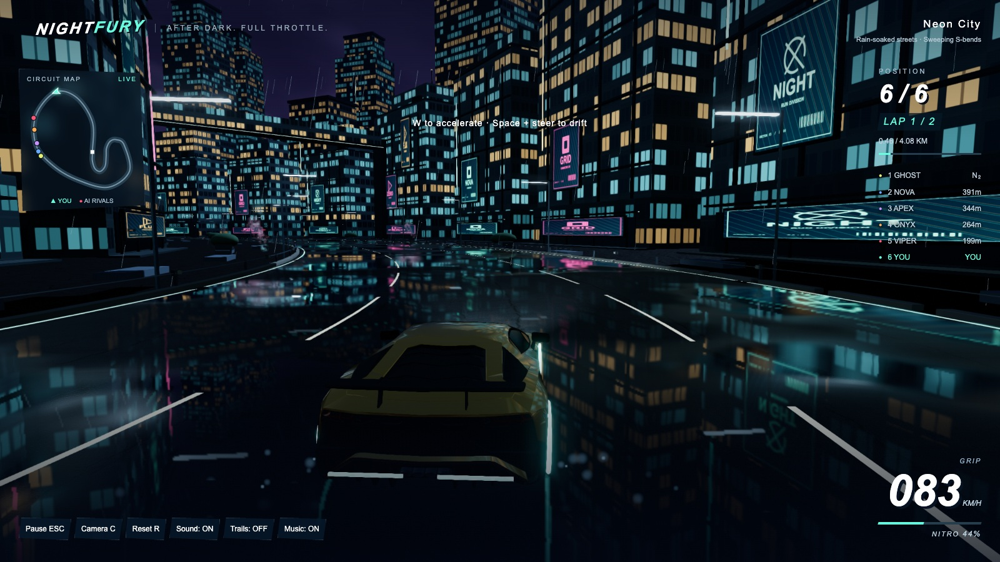
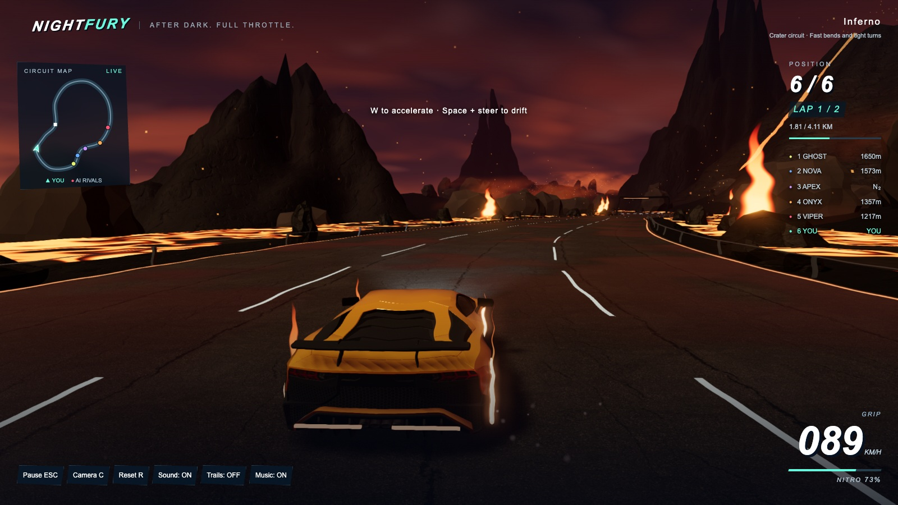
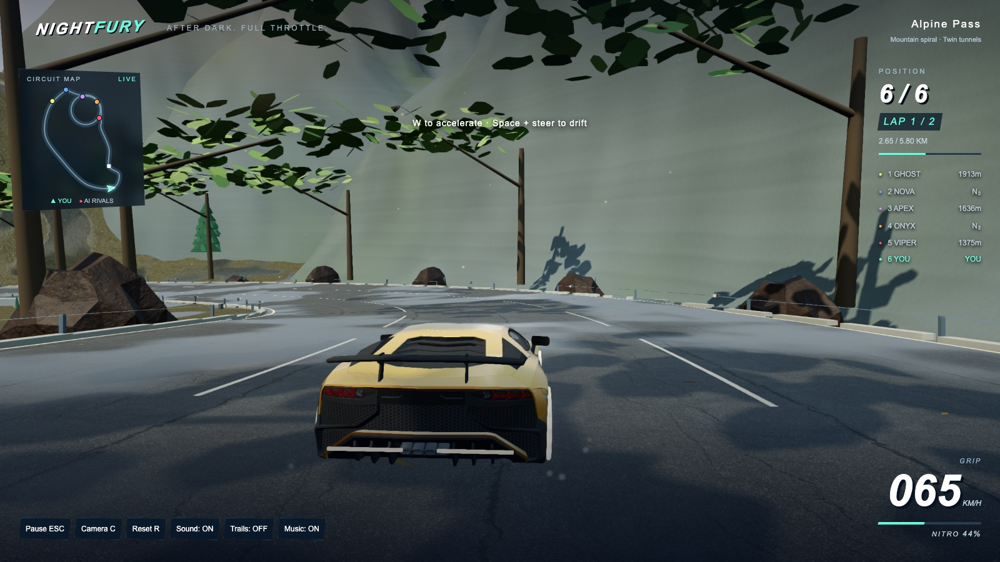
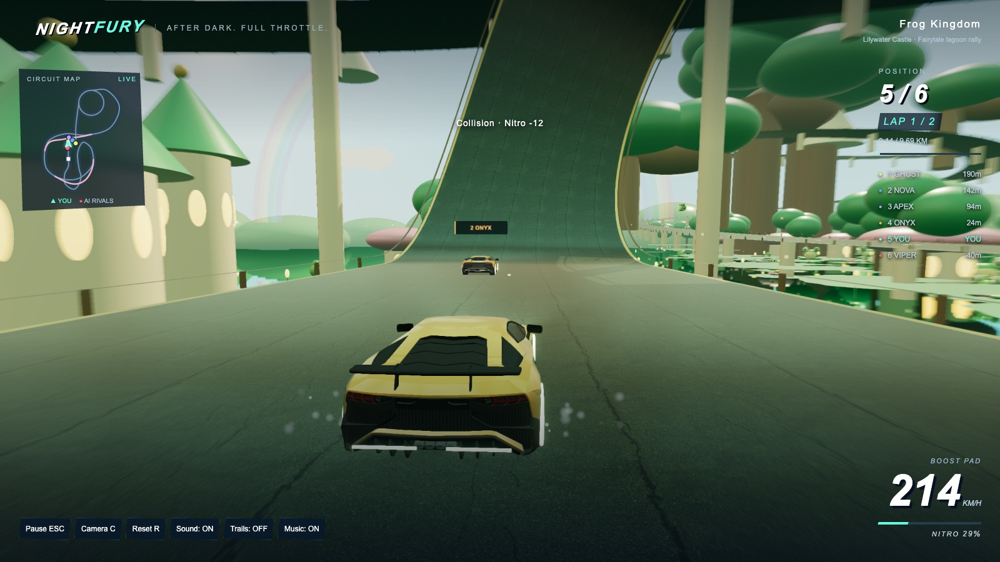
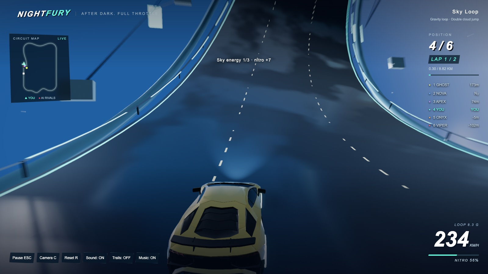
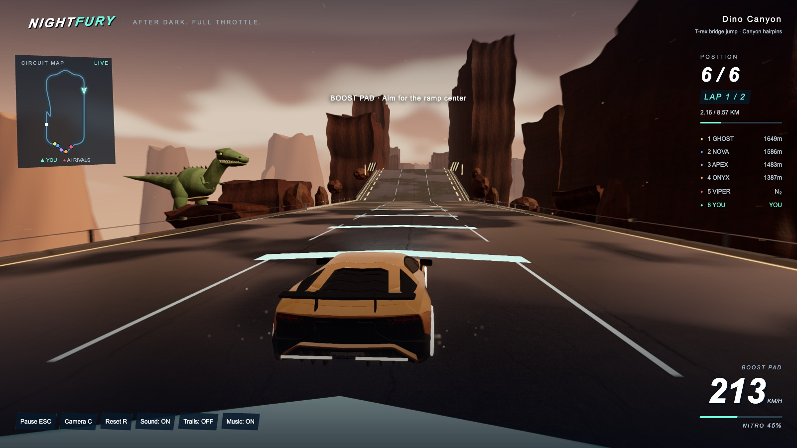
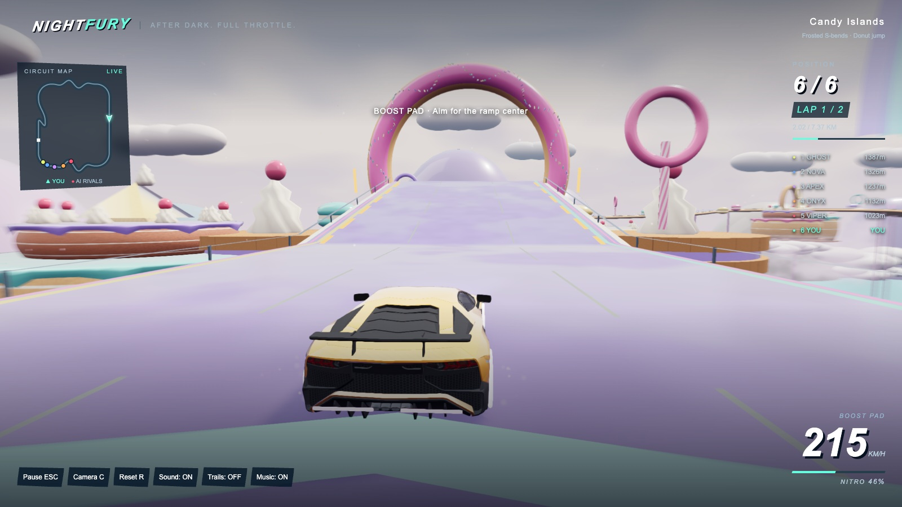
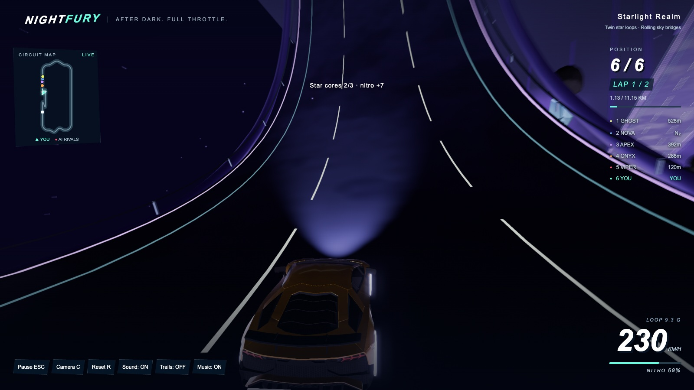

# NIGHTFURY

[简体中文](README.md) | **English**

This repository contains the deployable game release snapshot.

Browser arcade racing with eight tracks, two supercars, drifting, nitro, loops and jumps.

**[Play](https://ziang-chen.github.io/nightfury-racing/?lang=en) · [Gameplay gallery](https://ziang-chen.github.io/nightfury-racing/screenshots/) · [Artwork](https://ziang-chen.github.io/nightfury-racing/design.html?lang=en)**

## Play

- **PC:** keyboard controls. **Phones and tablets:** left steering stick and right action buttons; landscape recommended.
- Select **1–5 laps** and **Easy / Normal / Hard** on the track selection screen. Defaults: **2 laps, Normal**.
- Switch English / 中文 from the main menu or pause screen. Pause to resume, restart or choose another track.
- The first car load shows download progress. Music, sound, graphics and mobile auto throttle can be adjusted in Settings.

| Action | Keyboard |
| --- | --- |
| Accelerate / Brake and reverse | W / S or ↑ / ↓ |
| Steer | A / D or ← / → |
| Drift / Air flip | Space |
| Nitro | Shift |
| Camera / Reset to road | C / R |
| Pause / Mute effects | Esc / M |

## Run locally

Requires Python 3:

```sh
python3 -m http.server 8768 --directory dist
```

Open [localhost:8768](http://localhost:8768/).

## License

Original code: [MIT](LICENSE). Car models: CC BY 4.0. Third-party credits, sources and licenses: [notices](THIRD_PARTY_NOTICES.md) · [credits](https://ziang-chen.github.io/nightfury-racing/credits.html?lang=en).

## Gameplay

Gameplay screenshots and clips are refreshed with each release.

| Sky Loop | T-rex bridge jump |
| --- | --- |
|  |  |
| **Donut jump** | **Twin star loops** |
|  |  |

### All eight tracks

Actual driving views captured at 1600 × 900, refreshed with every release.

[Open the full gallery](https://ziang-chen.github.io/nightfury-racing/screenshots/)


**Neon City**



**Lava Volcano**



**Alpine Pass**



**Frog Kingdom**



**Sky Loop**



**Canyon Leap**



**Candy Islands**



**Starlight Realm**


