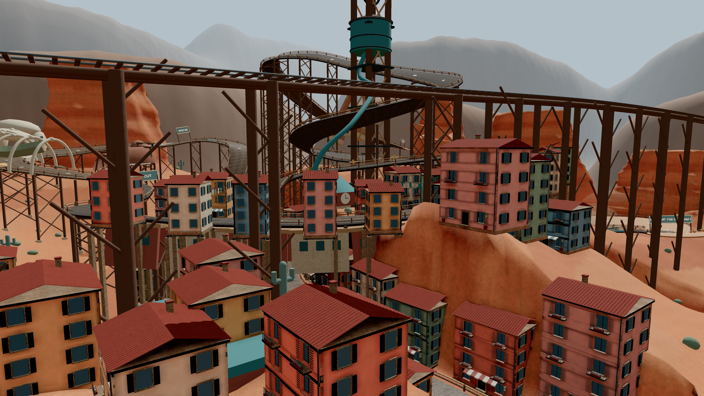
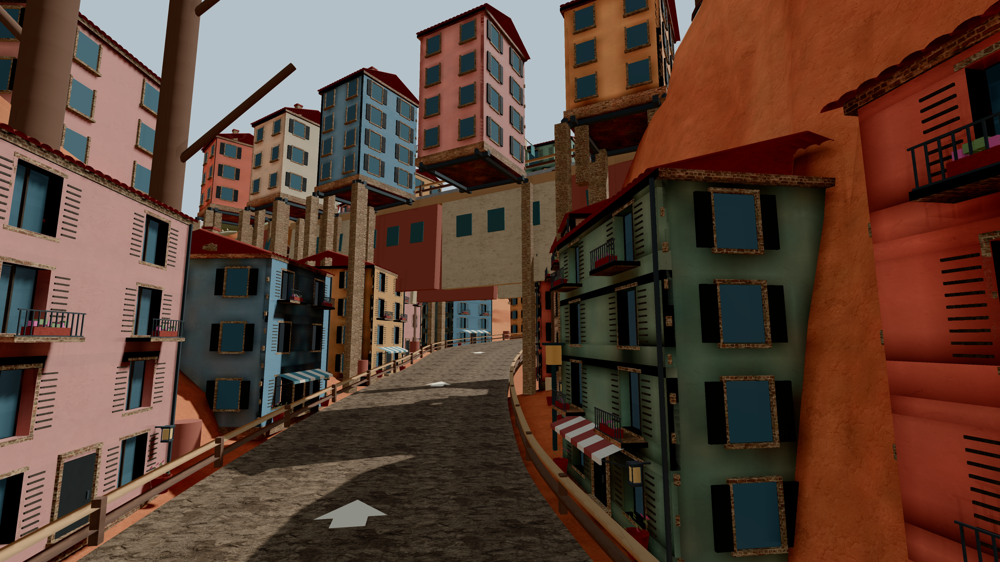
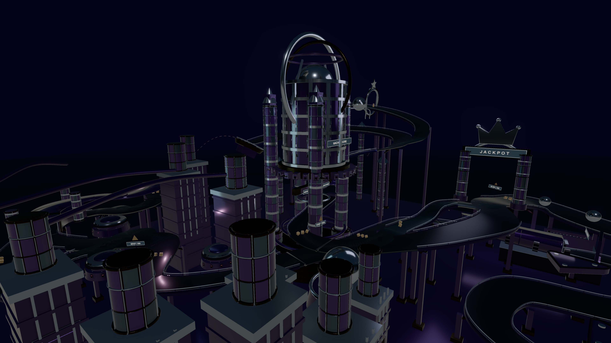
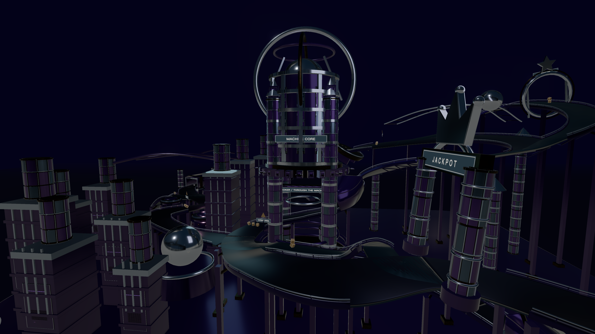

# NIGHTFURY · 极夜狂飙

**简体中文** | [English](README.en.md)

本仓库为可直接部署的游戏发布快照。

浏览器街机赛车：七张可选地图（含蛙国部分试玩）、两款跑车、漂移、氮气、回环与飞跃。

**[立即游玩](https://ziang-chen.github.io/nightfury-racing/?lang=zh) · [美术图集](https://ziang-chen.github.io/nightfury-racing/design.html?lang=zh)**

## 当前实机截图

4K 游戏实时渲染；自由镜头，隐藏 UI，保留游戏原有材质与光照。










## 游玩

- **PC** 使用键盘；**手机和平板** 使用左侧摇杆与右侧按钮，建议横屏。
- 地图选择页可选 **1–5 圈**和**轻松／普通／困难**，默认 **2 圈、普通**。
- 主菜单和暂停页可切换中英文。暂停后可继续、重赛或重新选图。
- 首次加载跑车会显示进度；音乐、声音、画质和手机自动油门可在设置中调整。

| 操作 | 键盘 |
| --- | --- |
| 加速／刹车、倒车 | W / S 或 ↑ / ↓ |
| 转向 | A / D 或 ← / → |
| 漂移／空中翻转 | Space |
| 氮气 | Shift |
| 切换镜头／回到路面 | C / R |
| 暂停／音效静音 | Esc / M |

## 本地运行

需要 Python 3：

```sh
python3 -m http.server 8768 --directory dist
```

打开 [localhost:8768](http://localhost:8768/)。

## 许可

原创代码使用 [MIT](LICENSE)，车辆模型使用 CC BY 4.0。第三方作者、来源与许可见[第三方声明](THIRD_PARTY_NOTICES.md)和[署名页](https://ziang-chen.github.io/nightfury-racing/credits.html?lang=zh)。

## 当前开放地图

以下入口打开当前游戏并选中对应地图。蛙国仅开放当前几何部分试玩，尚未完成。

- [霓虹都市](https://ziang-chen.github.io/nightfury-racing/?map=0&lang=zh) — 夜雨霓虹街区.
- [熔岩火山](https://ziang-chen.github.io/nightfury-racing/?map=1&lang=zh) — 熔岩与火山赛道.
- [翡翠雨林](https://ziang-chen.github.io/nightfury-racing/?map=2&lang=zh) — 林冠水市与巨木神庙.
- [蛙蛙王国 · 试玩](https://ziang-chen.github.io/nightfury-racing/?map=3&lang=zh) — 当前几何部分试玩，仍在制作中.
- [峡谷飞跃 · 新版](https://ziang-chen.github.io/nightfury-racing/?map=5&lang=zh) — 新版赤岩峡谷赛道.
- [星辉秘境](https://ziang-chen.github.io/nightfury-racing/?map=7&lang=zh) — 星桥与交错回环.
- [霓虹弹珠机](https://ziang-chen.github.io/nightfury-racing/?map=9&lang=zh) — 紫色赛博朋克弹珠赛道.

地图封面为 AI 生成的概念美术，不是实机截图。旧截图及暂未开放地图的宣传图保留在[美术图集](https://ziang-chen.github.io/nightfury-racing/design.html?lang=zh)和[历史实机截图](https://ziang-chen.github.io/nightfury-racing/screenshots/?lang=zh#archive)，与当前画面分开展示。
