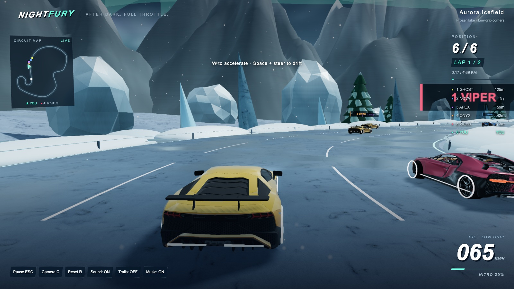

# NIGHTFURY · 极夜狂飙

**简体中文** | [English](README.en.md)

本仓库为可直接部署的游戏发布快照。

浏览器街机赛车：八张赛道、两款跑车、漂移、氮气、回环与飞跃。

**[立即游玩](https://ziang-chen.github.io/nightfury-racing/?lang=zh) · [实机展示](https://ziang-chen.github.io/nightfury-racing/screenshots/) · [美术图集](https://ziang-chen.github.io/nightfury-racing/design.html?lang=zh)**

## 游玩

- **PC** 使用键盘；**手机和平板** 使用左侧摇杆与右侧按钮，建议横屏。
- 地图选择页可选 **1–5 圈**和**轻松／普通／困难**，默认 **2 圈、普通**。
- 主菜单和暂停页可切换中英文。暂停后可继续、重赛或重新选图。
- 首次加载跑车会显示进度；音乐、声音、画质和手机自动油门可在设置中调整。

| 操作 | 键盘 |
| --- | --- |
| 加速／刹车、倒车 | W / S 或 ↑ / ↓ |
| 转向 | A / D 或 ← / → |
| 漂移／空中翻转 | Space |
| 氮气 | Shift |
| 切换镜头／回到路面 | C / R |
| 暂停／音效静音 | Esc / M |

## 本地运行

需要 Python 3：

```sh
python3 -m http.server 8768 --directory dist
```

打开 [localhost:8768](http://localhost:8768/)。

## 许可

原创代码使用 [MIT](LICENSE)，车辆模型使用 CC BY 4.0。第三方作者、来源与许可见[第三方声明](THIRD_PARTY_NOTICES.md)和[署名页](https://ziang-chen.github.io/nightfury-racing/credits.html?lang=zh)。

## 实机展示

实机截图与 GIF 随版本更新。

| 云端回环 | 霸王龙断桥 |
| --- | --- |
|  |  |
| **穿越甜甜圈** | **交错双星环** |
|  |  |

### 八张地图截图

八张地图各选取一段实际驾驶画面，以 1600 × 900 实机画面展示。截图随版本更新。

[打开全部截图](https://ziang-chen.github.io/nightfury-racing/screenshots/)


**霓虹都市**


**熔岩火山**


**山地森林**


**极光冰原**



**云端回环**


**峡谷飞跃**


**糖果云岛**


**星辉秘境**


